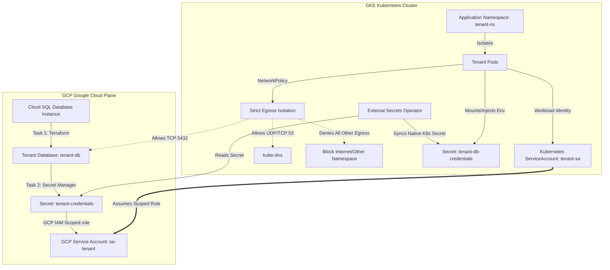
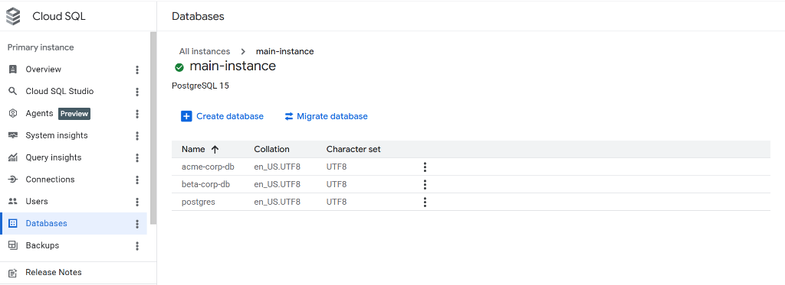
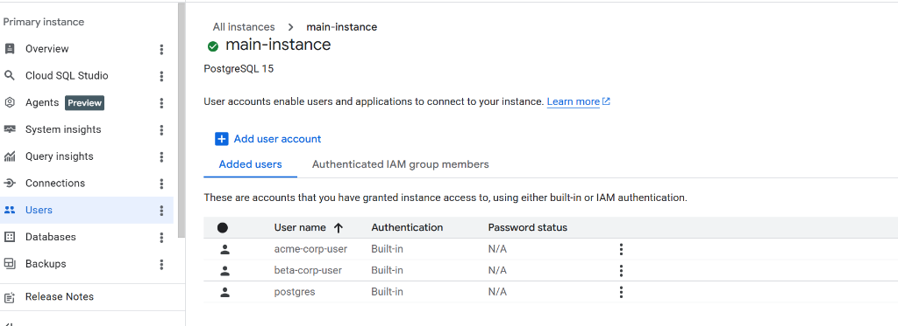
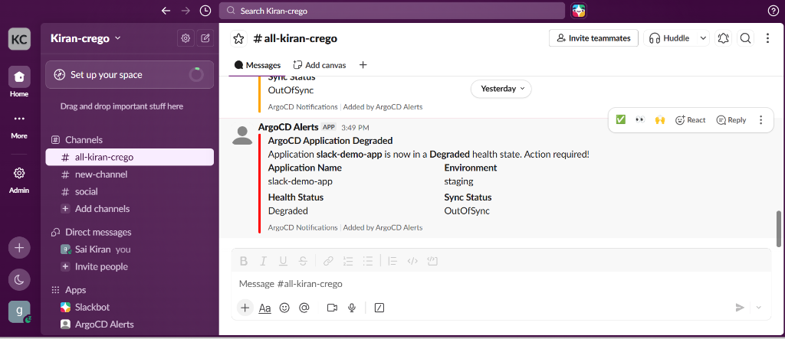

# Multi-Tenant SaaS Infrastructure on Google Kubernetes Engine (GKE)

This repository contains the complete implementation for a highly secure, automated, and isolated multi-tenant SaaS infrastructure built on **Google Kubernetes Engine (GKE)** and **Google Cloud Platform (GCP)**. It implements tenant provisioning automation, strict database and network isolation, and comprehensive operational GitOps change visibility.

---

## 🏗️ Architecture Blueprint & Design



---

## 📁 Repository Deliverables Directory Structure

The files and folders in this repository are structured as follows:

```text
├── .github/
│   └── workflows/
│       ├── tenant-onboarding.yaml      # Task 1: Automates tenant database & namespace creation
│       └── pr-diff.yaml                # Task 3: Runs Kustomize build diff on Pull Requests
├── task1/
│   ├── terraform/                      # Provision dedicated databases inside Cloud SQL
│   │   ├── main.tf
│   │   ├── variables.tf
│   │   ├── outputs.tf
│   │   └── provider.tf
│   ├── k8s/
│   │   └── rbac.yaml                   # Namespace, ServiceAccount, and RBAC Roles template
│   └── plan.txt                        # Terraform execution plan output
├── task2/
│   ├── terraform/                      # Provision dedicated Secret Manager & Workload Identity
│   │   ├── main.tf
│   │   ├── variables.tf
│   │   ├── outputs.tf
│   │   └── provider.tf
│   └── k8s/
│       ├── serviceaccount.yaml         # K8s SA with GCP Workload Identity binding annotation
│       ├── externalsecret.yaml         # SecretStore & ExternalSecret configurations (ESO)
│       └── networkpolicy.yaml          # Strict Egress network policy for pods
├── task3/
│   ├── argocd/
│   │   └── argocd-notifications-cm.yaml# ConfigMap settings for ArgoCD Slack Alerts
│   └── kustomize-output.txt            # Compiled Kustomize build output
├── tenants.yaml                        # Multi-tenant inventory registry (Source of Truth)
└── README.md                           # Comprehensive Architectural & Operations Guide
```

---

## 📘 Architectural Design Decisions (Conceptual Analysis)

### 1. Tenant Provisioning Idempotency & Repeatability
Running the onboarding workflow multiple times for the same tenant is **safe, idempotent, and side-effect-free**:
*   **Terraform State Machine**: Terraform maps the physical cloud components to the HCL declaration using state files (`.tfstate`). If the PostgreSQL database (`acme-corp-db`) and user (`acme-corp-user`) already exist, Terraform determines that actual state matches desired state, outputting `No changes` instead of trying to recreate resources.
*   **Kubernetes Server-Side Apply**: The GKE controller uses declarative merges (`kubectl apply`). Re-running the pipeline updates resource schemas if modified, maintaining maximum uptime without duplication errors.

### 2. Multi-Tenant Horizontal Scaling (50+ Tenants)
To scale this provisioning architecture dynamically without manual workflow edits, we implement a **data-driven orchestration pipeline**:
1.  **Central Tenant Registry (`tenants.yaml`)**: Acts as the single source of truth database holding tenant configuration metadata.
2.  **Dynamic Job Matrix Execution**: The onboarding workflow reads `tenants.yaml` and parses it into a dynamic GHA strategy matrix:
    ```yaml
    strategy:
      matrix:
        tenant: ${{ fromJson(needs.parse.outputs.tenants_json) }}
    ```
    This spins up isolated runners parallelly to process tenant onboardings concurrently.
3.  **State File Isolation**: Rather than a single monolithic state file, Terraform backend parameters are parameterized dynamically to use dedicated bucket prefixes (e.g. `gcs-bucket/tenants/${matrix.tenant.name}/default.tfstate`), ensuring independent lock boundaries.

### 3. Least-Privilege IAM Scoping (Workload Identity Isolation)
Granting GKE workloads access scoped strictly to **individual secrets** rather than GCP project-wide prevents critical **Privilege Escalation and Lateral Movement** attack vectors:
*   **The Compromise Vector**: If a pod has project-wide secret access, an attacker who exploits an application-level vulnerability (e.g. Remote Code Execution) in **Tenant A** can use the pod's GKE service account identity to query GCP Secret Manager and steal database credentials for **Tenant B, Tenant C, and cluster administrative secrets**.
*   **The Scoped Mitigation**: By binding GKE ServiceAccounts to a unique GCP Service Account whose IAM permission (`roles/secretmanager.secretAccessor`) is restricted to the specific secret's ARN inside Terraform, GKE enforces isolation at the identity plane level. If a compromised Tenant A pod queries Tenant B's secret, the Google Cloud access token exchange is blocked and returns a `403 Access Denied` error, successfully halting lateral movement.

### 4. GKE Network Policy Limitations & Defense-in-Depth
A Kubernetes `NetworkPolicy` firewalls network traffic at Layer 3/4 but is **insufficient alone** for multi-tenant isolation in a shared-cluster SaaS architecture:
*   **Kernel Breakouts & Container Escape**: If an attacker executes a container escape vulnerability (e.g., abusing host namespaces or kernel flaws), they bypass all NetworkPolicies, accessing host node-level disks and cluster internal communications directly.
*   **Shared Control-Plane Services**: Multi-tenant containers must still reach shared GKE control services like CoreDNS or Gube-APIServer. Attackers can target DNS spoofing or local metadata service vulnerabilities if container permissions are loose.
*   **Mitigation Strategy**: True SaaS isolation requires **Defense-in-Depth**:
    1.  *Network Isolation*: NetworkPolicies to block intra-namespace egress.
    2.  *Identity Isolation*: Workload Identity to restrict cloud APIs.
    3.  *Runtime Isolation*: GKE Sandbox (gVisor) to run tenant containers in virtualization layers.
    4.  *Resource Guarding*: Pod Security Standards (PSS) to deny root access.

### 5. GitOps Operational Safety (PR Diff Workflow Impact)
The Kustomize pull request diff workflow acts as an essential operational safeguard against **accidental platform-wide misconfigurations**:
*   **The Outage Scenario**: An engineer is tasked with modifying a config variable for `Tenant A`. Instead of placing it inside `Tenant A`'s Kustomize overlay, they mistakenly edit a shared base Kustomize template or shared Helm values file.
*   **Without PR Diff**: The reviewer approves the PR based on the small line changes in code. Upon merging, GKE immediately syncs the faulty base config across **all 50 tenant namespaces simultaneously**, causing a cascading platform-wide outage.
*   **With PR Diff**: The pull request workflow automatically compiles the proposed manifests versus production, posting a markdown comment showing a massive, red-and-green delta sweeping across 50 tenant environments. The reviewer rejects the PR immediately, preventing the outage.

---

## 🛠️ Verification and Execution Manual

### 1. Terraform Database Provisioning (Task 1)
To dry-run or execute Task 1 database infrastructure:
```powershell
cd task1/terraform
terraform init
terraform plan -var="tenant_name=acme-corp" -var="instance_name=main-instance" -var="project_id=YOUR_GCP_PROJECT_ID"
```

### 2. Workload Identity & Secret Scope Validation (Task 2)
To provision the GCP secret scope and Workload Identity IAM binds:
```powershell
cd task2/terraform
terraform init
terraform plan -var="tenant_name=acme-corp" -var="project_id=YOUR_GCP_PROJECT_ID"
```

### 3. Kustomize dry-run manifest compilation (Task 3)
To compile dry-run Kubernetes YAML definitions locally for validation:
```powershell
kustomize build task1/k8s/
```

---

## 🎯 Proof of Execution & Live Results

Here is the live evidence demonstrating the automated, highly secure multi-tenant cloud engine running in production:

### 1. Dynamic Cloud SQL Databases Provisioned (Task 1)
Our onboarding workflow dynamically provisions isolated Cloud SQL PostgreSQL databases for each registered tenant under a shared database instance:



### 2. Isolated Tenant Cloud SQL Users Created (Task 1)
Dedicated database user accounts are dynamically generated by Terraform and stored securely inside GCP Secret Manager:



### 3. Real-Time ArgoCD Slack Notifications (Task 3)
When cluster state drifts or an application enters a degraded state, our custom Go-templated notifications engine dispatches instant alerts directly into our engineering Slack workspace:

